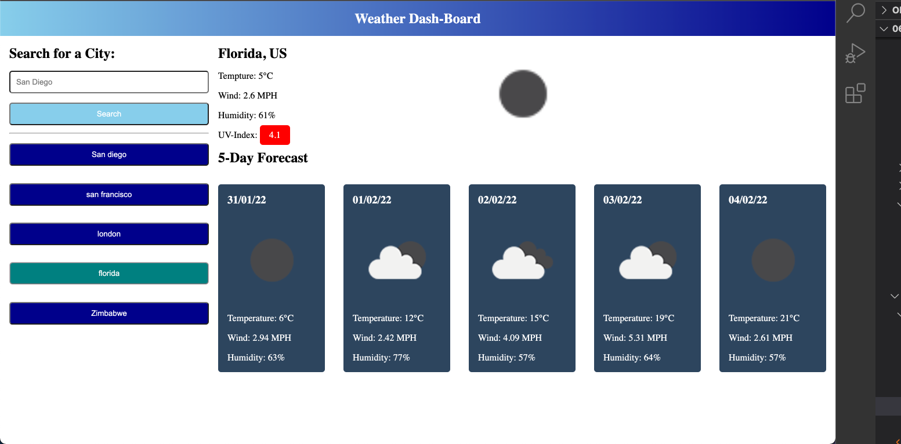

### Deployed Link
- https://bdejene19.github.io/WeatherDashBoard/ 

# Weather Network - Shortcuts Included
## Live Screenshot: 
;

## About 
Allow user's to search the current and 5-day forecast for locations across the globe. Successful searches will display date, temeprature, wind, humidity and UV-index for the searched location name. A shortcut to that previous successful search will be saved to local storage for persistence, preventing user from having to retype city names for future weather queries.

